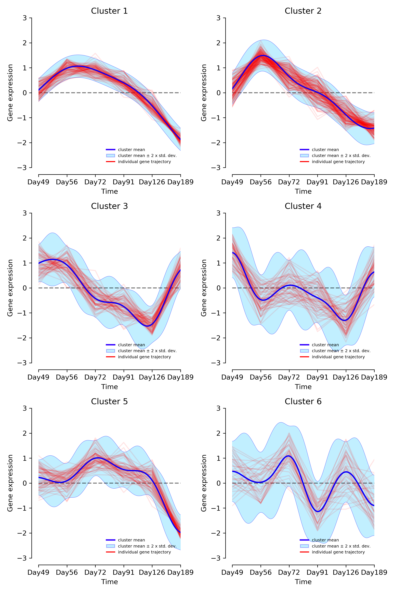
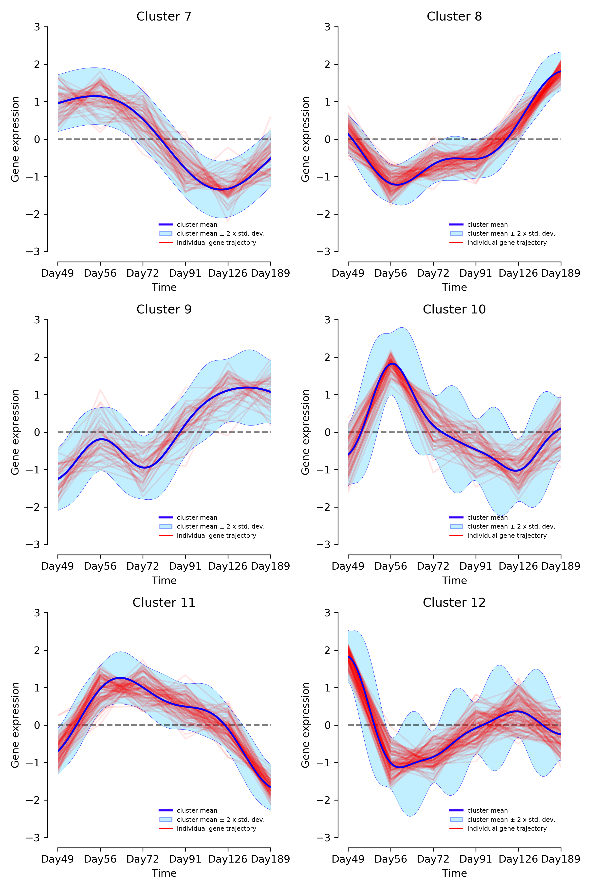
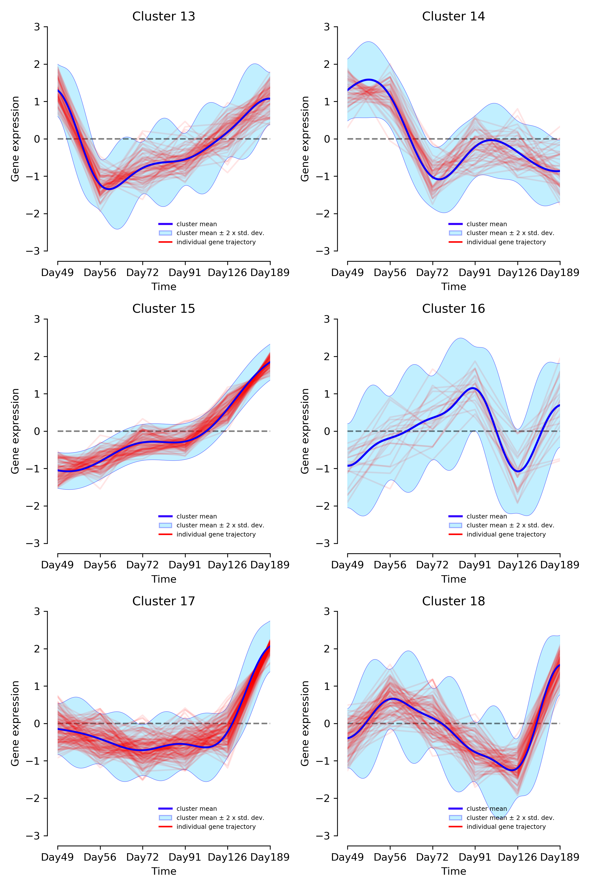
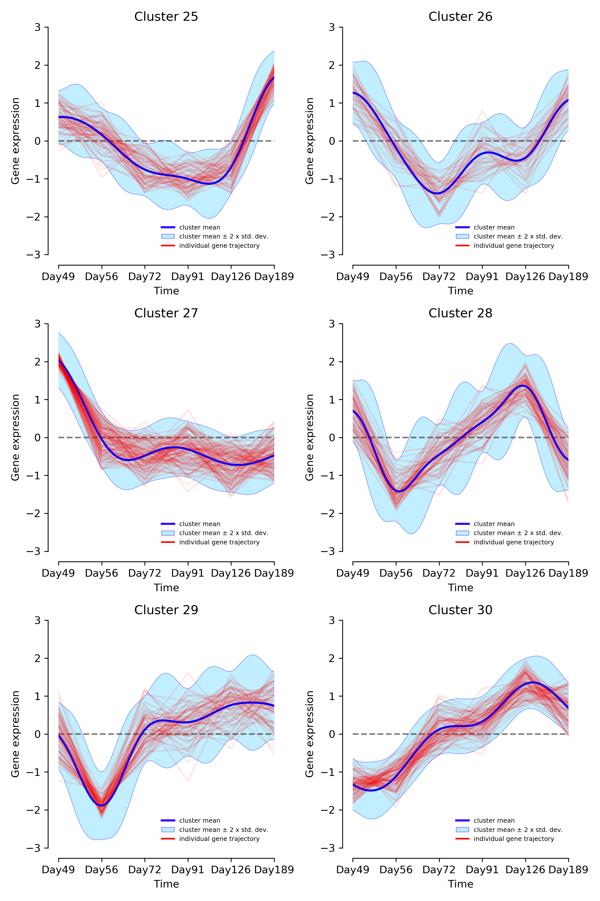
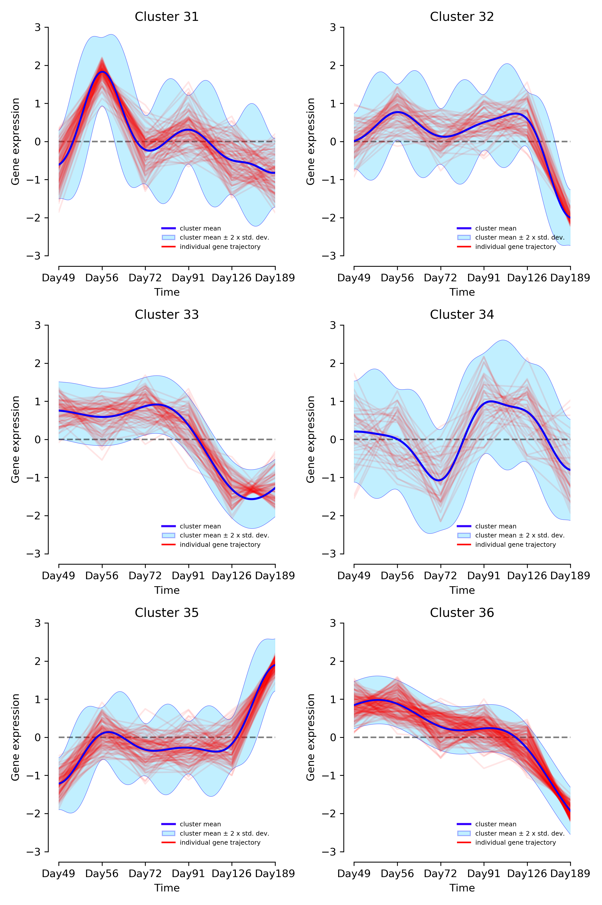
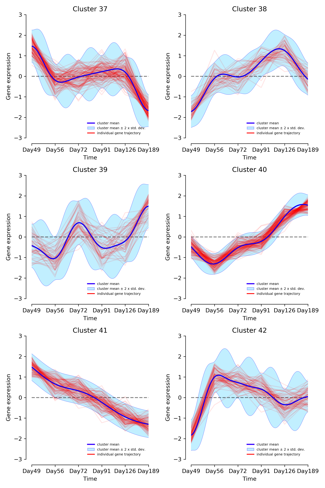
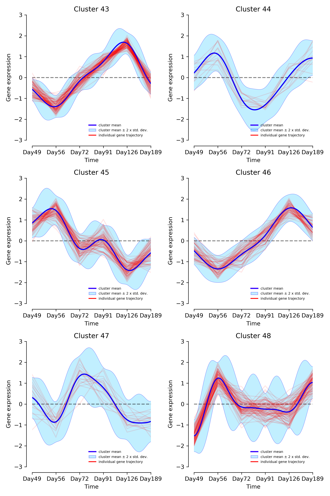
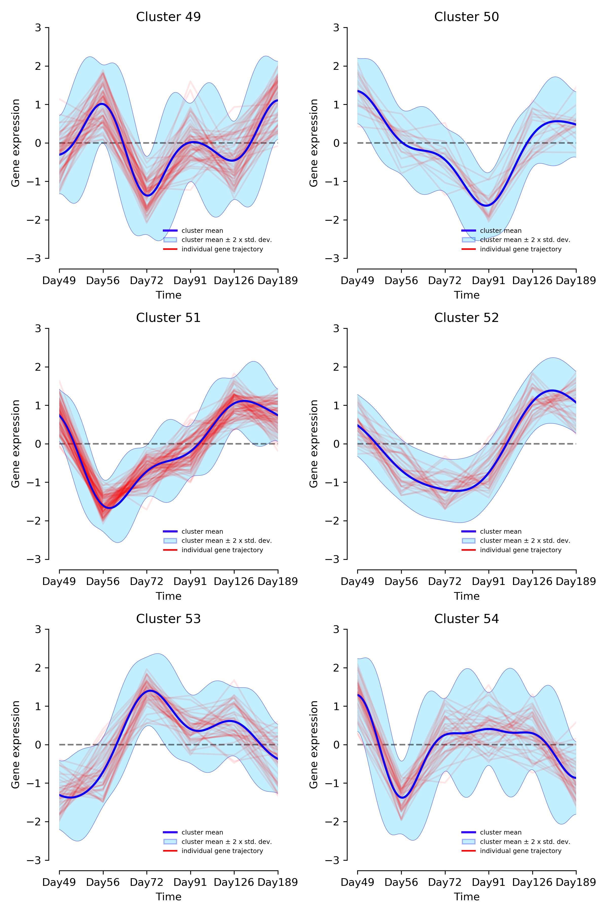
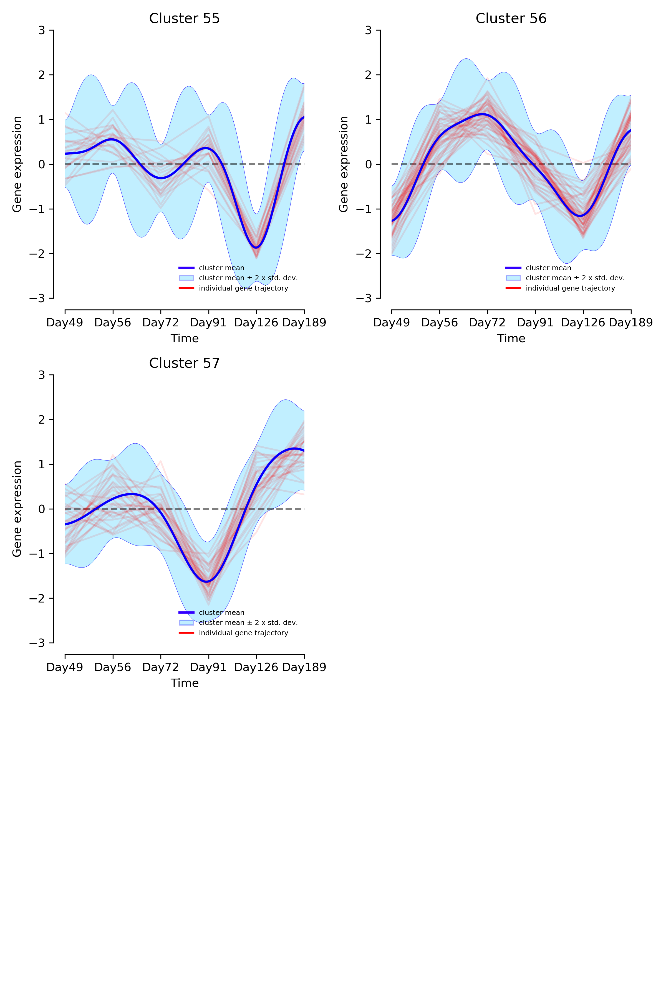

# R05 clustering, no NA values, |LFC| > 1
No `--do_not_mean_center` parameter

Notes:
* Cluster 1 - up at 49d then gradual drop
* Cluster 2 - drops at 49d, up again at 56d, then down
* Cluster 15 - gradual increase over time
* Cluster 41 - gradual decrease (but may be preceded by a 0 -> 49d upregulation)

| | |
|-|-|
|  |  |
|  |  |
|  |  |
|  |  |
|  | |
