## Results summary
In each control vs. resting comparison, only around 2000-4000 genes are up/downregulated with |LFC| > 1,  
and around 3000-5000 are up/downregulated with |LFC| > 0.585, meaning that the majority do not appear to  
be differentially expressed (see [`04_DiffExp`](../04_DiffExp)),  despite resting stages being 'dormant'  
* DOUBLE-CHECK RESULTS WITHOUT LFC THRESHOLD

## Pathways

### Glycolysis
**Relevance**: Ultimately leads to the production of pyruvate and energy

This pathway appears to be largely downregulated. However, there are some exceptions:
* One copy of **glucose-6-phosphate isomerase** (`Sm_t00012052-RA`) is slightly upregulated in R05
* One copy of **fructose-bisphosphate aldolase** (`Sm_t00010852-RA`) is upregulated in the first one (GF04) or two (R05) timepoints, but downregulated later
* One copy of **triosephosphate isomerase** (`Sm_t00010996-RA`) is upregulated early at 49d before being downregulated in R05, and is consistently upregulated through to 91d in GF04
* One copy of **glyceraldehyde-3-phosphate dehydrogenase** (`Sm_t00011559-RA`) is upregulated throughout, especially in R05
  * "In addition to this long established metabolic function, GAPDH has recently been implicated in several non-metabolic processes,
     including transcription activation, initiation of apoptosis, ER to Golgi vesicle shuttling, and fast axonal, or axoplasmic transport" (Wikipedia)
* One copy of **phosphoglycerate kinase** (`Sm_t00000224-RA`) is upregulated throughout, especially in GF04
  * Another copy (`Sm_t00007435-RA`) is upregulated throughout in R05, and at 49d before downregulation in GF04
* One copy of **phosphoglycerate mutase** (`Sm_t00003852-RA`) is upregulated in later timepoints in both strains (early NAs)
  * Another copy (`Sm_t00000874-RA`) is upregulated at 56d, but downregulated at all other timepoints (NA at 72d)
* In R05, one copy of **enolase** (`Sm_t00022481-RA`) is upregulated between 56d and 91d (others NA), while the other copy (`Sm_t00022487-RA`) has all NAs
  * In GF04, the both copies are upregulated at 56d but downregulated the rest of the time (with a couple of NAs)
* Three copies of **pyruvate kinase** (`Sm_t00008044-RA`, `Sm_t00010856-RA`, `Sm_t00010857-RA`) are upregulated to varying degrees throughout, especially in GF04

With a |LFC| > 1 threshold, genes showing upregulation are:
* Phosphoglycerate kinase (`Sm_t00000224-RA`)
* Pyruvate kinase (`Sm_t00010857-RA`)
* R05 only:
  * Glyceraldehyde-3-phosphate dehydrogenase (`Sm_t00011559-RA`)
* GF04 only:
  * Fructose-bisphosphate aldolase (`Sm_t00010852-RA`, 49d only)
  * Triosephosphate isomerase (`Sm_t00010996-RA`, 49d + 56d only)
  * Enolase (`Sm_t00022481-RA`, 56d only)
  * Pyruvate kinase (`Sm_t00010856-RA`)

**Overall, the pathway seems to be downregulated, with a spike in activity at 56d, as though the cells are reacting to the introduction of nitrate**
* **Some genes, particularly in the lower 'pay-off' part of the pathway are strongly upregulated throughout**
* _The reactant feeding into the lower half - glyceraldehyde 3-phosphate - is a byproduct in tryptophan synthesis, and a reactant in thiamine biosynthesis_

Where there are multiple copies of a gene, some are upregulated while others are downregulated
* How different are their sequences?

| R05 | GF04 |
|-----|------|
| 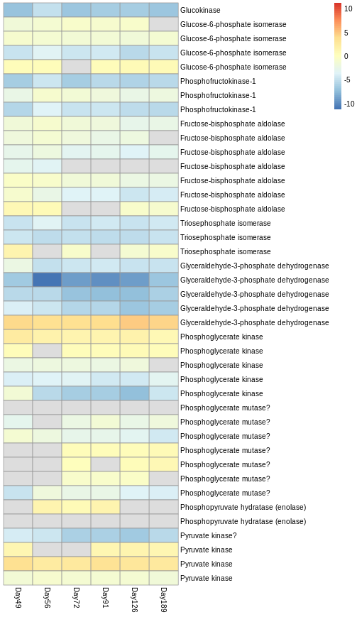 | 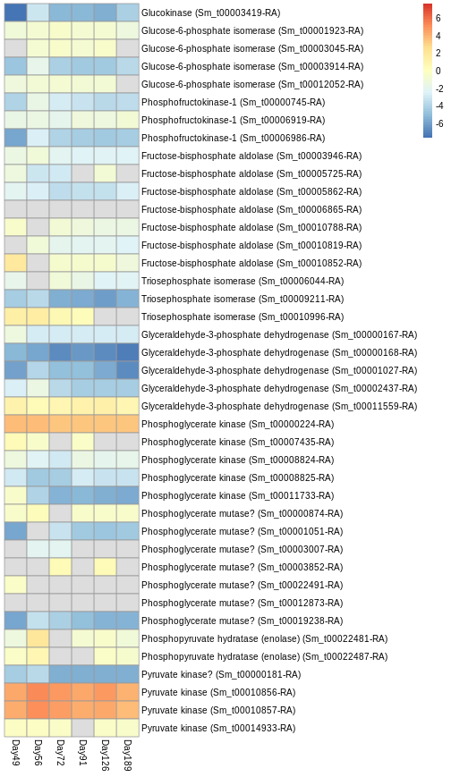 |

### Citric Acid Cycle (a.k.a. TCA cycle, Krebs cycle)
**Relevance:** Energy release from fats, carbohydrates and proteins, and production of NADH and AA precursors

**Expectations in nitrogen starvation, darkness, and anoxia?**
* Nitrogen starvation
  * [Lin et al., 2017](https://doi.org/10.1371/journal.pone.0184849) - upregulation of several TCA cycle genes (_T. pseudonana_, 7 days)
  * [Alipanah et al., 2015](https://doi.org/10.1093/jxb/erv340) - upregulation of early TCA cycle genes (_P. tricornutum_, 3 days)
  * [Levitan et al., 2015](https://doi.org/10.1073/pnas.1419818112) - upregulation of TCA cycle genes (_P. tricornutum_, 2 days)
  * [Pelusi, 2019](https://doi.org/10.21954/ou.ro.0000e77c) - upregulation of most TCA cycle genes (_C. socialis_, 4 days)

* Darkness
  * [Kennedy et al., 2019](https://doi.org/10.1111/nph.15843) - upregulation of TCA cycle later in the experiment, from day 30 (_F. cylindrus_, 120 days + recovery)
    * "This delayed upregulation appears to correspond with the expression of the EDP [Entner-Doudoroff pathway] and lower-phase mitochondrial glycolytic proteins."

* Anoxia
  * ?????????

The cycle overall seems to be downregulated, with upticks at 56d and 189d
* **This seems to be at odds with the above studies, which found TCA cycle upregulation!**
* A few genes appear to be **up**regulated, albeit very slightly
  * a-ketoglutarate dehydrogenase E2 (Sm_t00006507-RA)
  * Fumarate hydratase (class II) (Sm_t00006973-RA)
  * Malate dehydrogenase (cytosolic) (Sm_t00001686-RA)
* The most noticably upregulated of the above is the **fumarate hydratase (class II)** (`Sm_t00006973-RA`)
  * MAY be targeted to the mitochondrion, which would indicate a role in the TCA cycle
    * Cytosolic fumarase is involved in AA metabolism?
    * Yogev et al. (2010) implies both that cytosolic AND mitochondrial fumarase is encoded from the same gene, and that cytosolic fumarase
      is involved in scavenging of fumarate from the urea cycle, AA catabolism, and DSB break repair!
      * E. coli sequence also shows no indication of mitochondrial targeting
  * The other fumarase (class I, `Sm_t00010766-RA`), is very likely mitochondrial, perhaps implying the upregulated one is cytosolic?

| R05 | GF04 |
|-----|------|
| 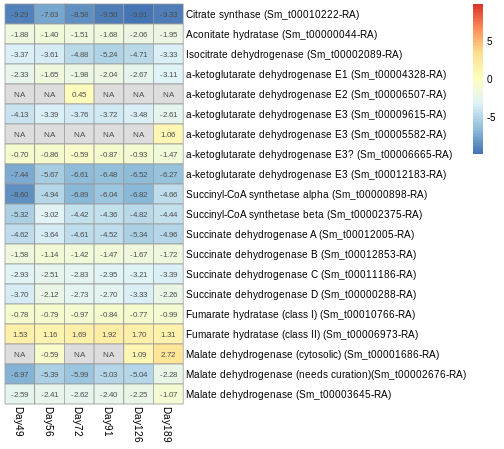 | 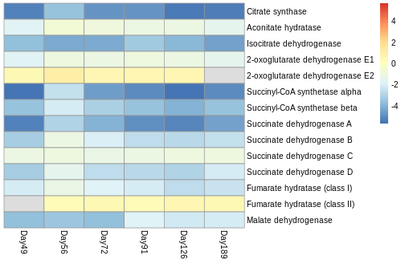 |

### Gluconeogenesis
**Relevance**: Production of hexoses from pyruvate as fuel for storage carbohydrate synthesis

Seems to be upregulated overall, to varying degrees
* Note: Sm_t00006651-RA _does_ have the lowest average N content in AA sidechains of the three pyruvate kinases identified, after manual correction of indels in the reference
  * 0.307 vs. 0.345/0.341; check whether this is significant

Note that glucose-6-phosphatase (final step in gluconeogenesis) has not yet been identified in diatoms

| R05 | GF04 |
|-----|------|
| 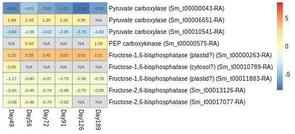 | 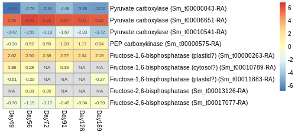 |

### Pentose phosphate pathway
**Relevance**: Parallel process to glycolysis

(Cytosolic in diatoms? [cf. plastidic in plants])

Largely upregulated, especially phosphopentose isomerase

_What are the consequences in terms of products?_

| R05 | GF04 |
|-----|------|
|  | 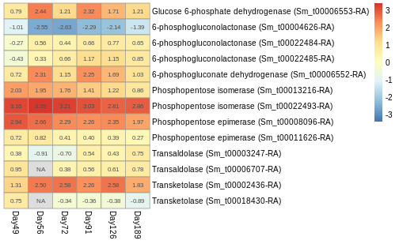 |

### Urea Cycle (a.k.a. ornithine-urea cycle)
**Relevance:** Production of urea, potential nitrogen storage? _Check specifics in literature_

**Expectations in nitrogen starvation, darkness, and anoxia?**
* Nitrogen starvation
* Darkness
* Anoxia

Parts of the cycle are upregulated at all times, some experience an uptick, others are downregulated
* Most obviously upregulated (esp. in GF04):
  * Carbamoyl phosphate synthetase (Sm_t00011045-RA) - cytosolic
  * Carbamoyl phosphate synthetase (Sm_t00016890-RA) - mitochondrial
    * Accumulation of carbamoyl phosphate?
      * Synthesis of pyrimidines?
  * Argininosuccinate lyase (Sm_t00022473-RA)
    * Accumulation of arginine?
  * Putative ornithine decarboxylase (Sm_t00013313-RA)
    * Accumulation of polyamines?
* Most obviously downregulated (esp. in GF04):
  * Urease accessory protein (Sm_t000022475-RA)
  * Active urea transporter (Sm_t00011008-RA)

* What is the consequence of this regarding accumulation of intermediates?

| R05 | GF04 |
|-----|------|
| 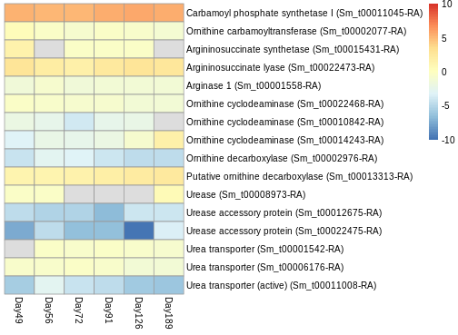 | 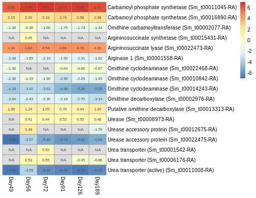 |

### Pyrimidine synthesis
**Relevance**: Upregulation of carbamoyl phosphate synthetase (as seen above) may result in increased carbamoyl phosphate, which is upstream of pyrimidine synthesis
* Is the rest of the pathway upregulated?

Some genes modestly upregulated, particularly in GF04
* Bifunctional dihydrofolate reductase/thymidylate synthase (Sm_t00001474-RA) downregulated,
  implying that this is primarily for production of RNA, not DNA?

| R05 | GF04 |
|-----|------|
| 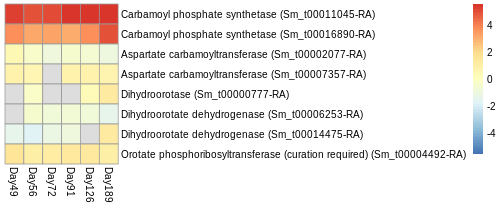 | 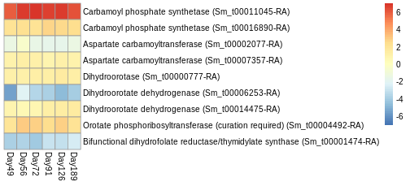 |

### Purine synthesis
**Relevance**: As pyrimidine synthesis may be modestly upregulated, what about purine synthesis?

### GS-GOGAT cycle
**Relevance**: Ammonium assimmilation (i.e. downstream from DNRA?)

Two glutamate synthases seem to be upregulated  throughout

_Are there any more glutamine synthetases I'm missing?_

| R05 | GF04 |
|-----|------|
| 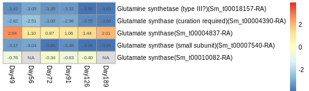 | 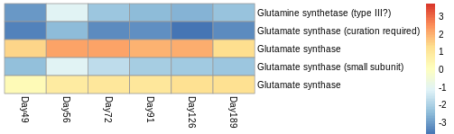 |

### Ribosomes
**Relevance**: Potential nitrogen storage, or protein synthesis is in overdrive to ensure survival

Ribosomal proteins are upregulated at all timepoints during the experiment
* R05 has a peak at 49d
* GF04 has a peak at 56d

_Likely missing some ribosomal proteins at the moment_

| R05 | GF04 |
|-----|------|
| 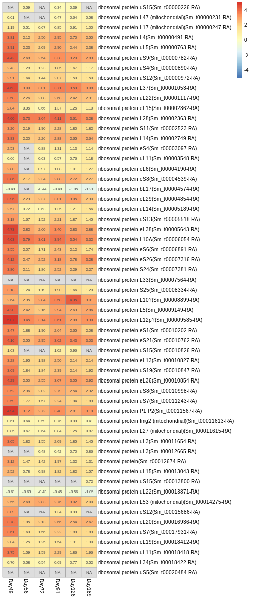 | 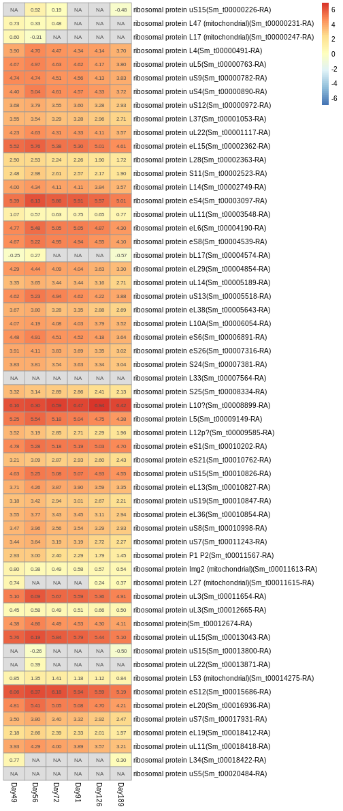 |

### DNRA
**Relevance**: Phenomenon seen in several diatoms as a means of anaerobic energy generation

Both nitrate reductase (Sm_t00006755-RA) and nitrite reductase (Sm_t00001748-RA) show increased expression at 49d before dropping
* Nitrate reductase shows LFC 3.93 increase at 49d in R05, LFC 8.15 increase at 49d in GF04 (upregulated throughout)
* Nitrite reductase shows LFC 2.66 increase at 49d in R05, LFC 5.35 increase at 49d in GF04
  * Downregulated in all subsequent R05 timepoints, upregulated at 56/72d in GF04 (down at 189d, rest not significant)
* **This is consistent with expectations regarding resting stages being capable of DNRA**

* Nitric oxide reductase (Sm_t00000914-RA and Sm_t00013435-RA?) slightly upregulated; consequences?
* No nitrous oxide reductase found

_Any further conclusions to be drawn?_

| R05 | GF04 |
|-----|------|
| 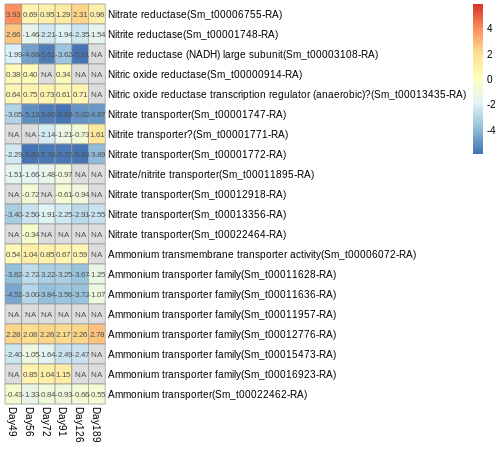 | 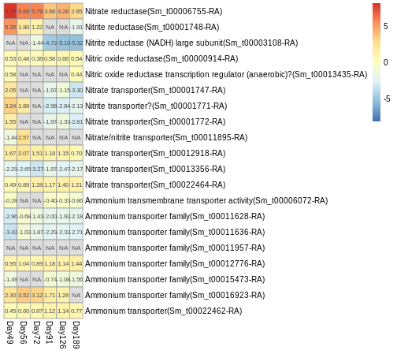 |

### Calvin cycle
**Relevance**: Related to photosynthesis, so would expect downregulation

Some upregulated genes shared with glycolysis:
* Phosphoglycerate kinase (Sm_t00000224-RA)
* Glyceraldehyde 3-phosphate dehydrogenase (Sm_t00011559-RA)
* Triosephosphate isomerase (Sm_t00010996-RA)
* Fructose-bisphosphate aldolase (Sm_t00010852-RA)

Some upregulated genes are shared with the pentose phosphate pathway
* Transketolase
* Phosphopentose isomerase
* Phosphopentose epimerase

Fructose-1,6-bisphosphatase is shared with gluconeogenesis

Phosphoribulokinase (Sm_t00022457-RA) is only upregulated at 49d, but quite significantly so; it then moves into downregulation
* This gene is supposed to be unique to the Calvin cycle, and the sequence appears to be accurate (if anything, the gene model should be extended a little)
* Why would such a gene be upregulated in darkness?
  * Also requires ATP so would be expending energy this way...

Sedoheptulose-1,7-bisphosphatase (Sm_t00001110-RA) is also upregulated and yet unique to the Calvin cycle

_Note: Some of the a-ketoglutarate dehydrogenase E3 predictions may be dihydrolipoyl dehydrogenase
(i.e. pyruvate dehydrogenase complex E3)_

| R05 | GF04 |
|-----|------|
| 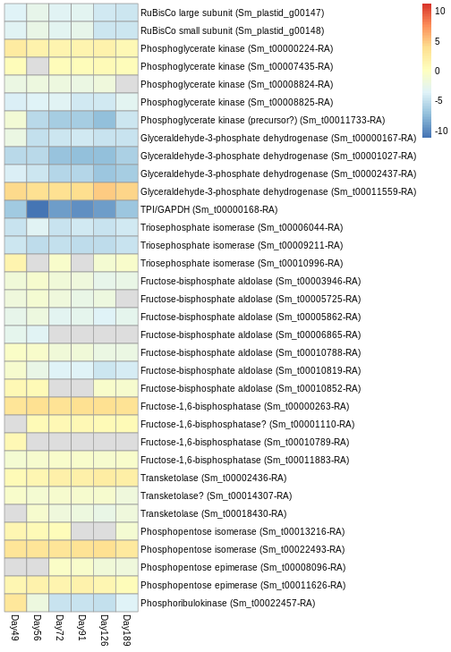 | 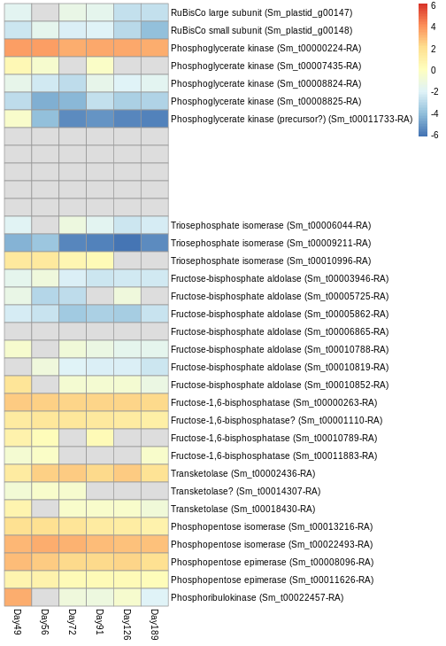 |

### Transporters
**Relevance**: If transporters, particularly active ones, are being produced, the product they're transporting is likely of importance

#### V-type ATPases
"V-ATPases couple the energy of ATP hydrolysis to proton transport across intracellular and plasma membranes of eukaryotic cells." (Wikipedia)

One V-type proton ATPase 16 KDa proteolipid subunit (Sm_t00014741-RA) appears to be upregulated in R05 at all timepoints
* A few others seem to be slightly upregulated

| R05 | GF04 |
|-----|------|
| 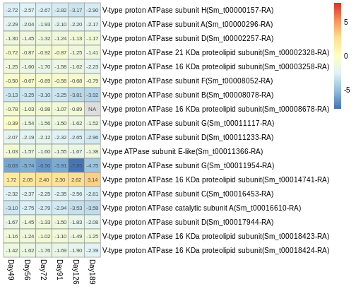 | 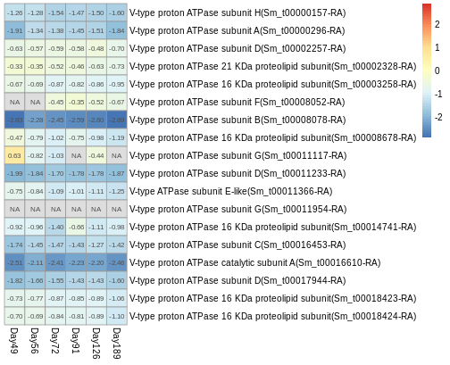 |

### Mitochondrion

Mitochondrial genes are either downregulated or NAs...

| R05 | GF04 |
|-----|------|
| 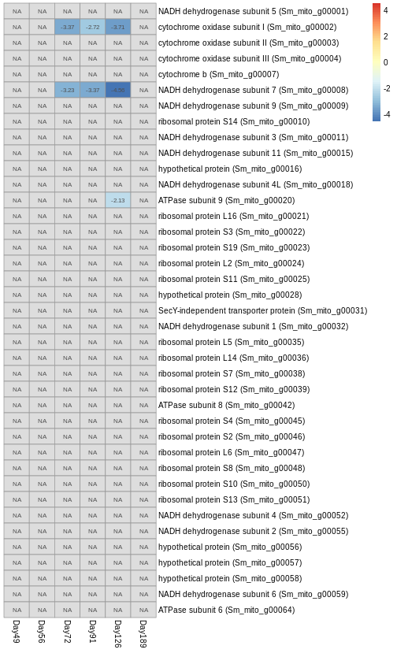 | 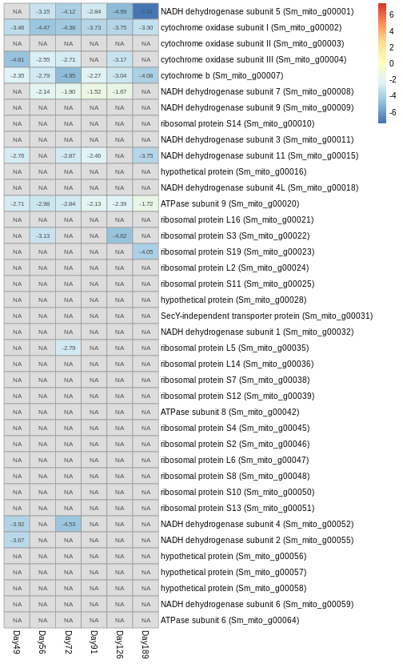 |

### Plastid

Plastid genes differ in their regulation; what does this mean?

* Thiamine biosynthesis protein upregulated at day 49 in R05
* Photosystem II protein W upreuglated at day 49 in GF04
* Heat shock protein 70 very upregulated in most cases (NA in R05 126d)
  * Stress-related so this seems reasonable
* Elongation factor Tu upregulated at some GF04 timepoints (R05 shows downregulation)
* Ribosomal proteins L21, L27, and L34 upregulated at most timepoints in both strains (present in repeat region)
* Ribosomal protein S14 upregulated at most timepoints in both strains
  * S18 strongly upregulated in GF04 only
* Preprotein translocase subunit SecA upregulated in both strains at all timepoints (present in repeat region)
  * According to Kim et al., 2020, involved in transporting proteins INTO the thylakoid lumen (requires ATP)
* Cell division protein upregulated in both strains (first three in R05, all in GF04)
  * From NCBI: "ATP-dependent zinc metalloprotease FtsH family protein similar to Arabidopsis thaliana FTSH 8,
    part of a complex that functions as an ATP-dependent zinc metallopeptidase, and which is involved in the
    thylakoid formation and in the removal of damaged D1 in the photosystem II, preventing cell death under
    high-intensity light conditions."
* Mg-protoporyphyrin IX chelatase upregulated in both strains

Why are only SOME ribosomal proteins upregulated? Some are also explicitly DOWNregulated (many NAs too)

| R05 | GF04 |
|-----|------|
| 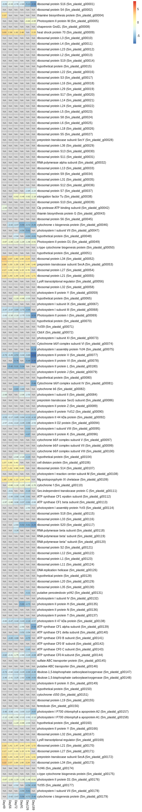 | 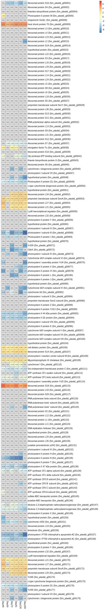 |
